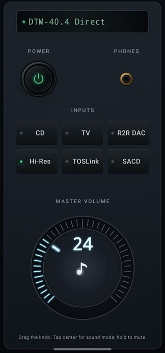

# Onkyo Remote for Android

Native Android remote control for Onkyo and Integra receivers. It communicates through eISCP, the Ethernet version of the Integra Serial Control Protocol documented by Onkyo Corporation. The protocol implementation and command mapping are based on the excellent Python project [`miracle2k/onkyo-eiscp`](https://github.com/miracle2k/onkyo-eiscp), rewritten here as a native Kotlin application with no Python runtime or web server required.

## What it can do

- Automatically discover compatible eISCP receivers on the local network, or connect to a manually entered IP address.
- Keep finding a receiver through Auto-discover if its DHCP address changes.
- Turn the receiver on and off.
- Select an input with a short tap.
- Give every input a custom name with a long press; names are remembered between launches and application updates.
- Control volume with a large hardware-style knob, haptic feedback, and protection against dangerous accidental volume jumps.
- Switch between Direct, Stereo with Music Optimizer ON, and Stereo with Music Optimizer OFF by tapping the center of the knob.
- Mute or restore playback with a long press on the knob center.
- Follow power, input, volume, mute, and sound-mode changes made on the receiver or another remote.
- Reconnect automatically when the application returns to the foreground.
- Run in Demo mode without a receiver, using a long press on the `PHONES` socket.



## Download

[Download the latest APK](https://raw.githubusercontent.com/git-moiseev/onkyo-eiscp-android/main/releases/latest/OnkyoRemote.apk)

The interface deliberately resembles a dark hi-fi front panel rather than a standard Android control screen. Its main control is a custom-drawn 270-degree volume knob with hardware-style lighting, texture, haptics, and touch gestures.

## Features

### Receiver connection

- Automatic receiver discovery using the standard eISCP UDP broadcast on port `60128`.
- Manual IP address configuration.
- Persistent Auto-discover mode for receivers whose DHCP address can change.
- Receiver model and identifier obtained from the eISCP discovery response.
- Persistent TCP connection for commands and unsolicited receiver updates.
- Automatic reconnect when the application returns to the foreground.
- Connection setup by long-pressing the status display.
- Receiver and playback state shown on a hardware-style LED display.

### Main controls

- Receiver power on/off.
- Six main-zone input selectors with an active-input LED.
- Main-zone volume from `0` to `80` using a custom Compose `Canvas` knob.
- Approximately 270 degrees of knob rotation with radial ticks and an active blue scale.
- Haptic feedback while changing volume.
- Mute/unmute from the center of the knob.
- Listening Mode and Music Optimizer control.
- Live synchronization with changes received from the receiver.

### Knob center gestures

Short taps cycle through these sound profiles:

1. `Direct` — `LMD01`, shown with a white musical note.
2. `Stereo, Music Optimizer ON` — `LMD00` + `MOT01`, shown in blue.
3. `Stereo, Music Optimizer OFF` — `MOT00`, shown in green.

A long press toggles mute:

- while muted, the center displays a red mute icon;
- short taps are ignored while muted;
- another long press restores playback and the musical-note indicator.

The status display shows the corresponding state, for example:

```text
DTM-40.4 Direct
DTM-40.4 Stereo MoON
DTM-40.4 Stereo MoOFF
DTM-40.4 Muted
```

Only `Muted` is displayed in red; other status text remains green.

### Configurable inputs

Long-press any input button to rename it. Renaming is available while the receiver is on, in standby, disconnected, or while Demo mode is active.

Default buttons and eISCP input codes:

| Default name | Receiver input | eISCP command |
|---|---|---|
| DVD | `dvd` | `SLI10` |
| TV | `tape-1` | `SLI20` |
| VIDEO1 | `video1` | `SLI00` |
| VIDEO2 | `video2` | `SLI01` |
| PS3 | `video3` | `SLI02` |
| CD | `cd` | `SLI23` |

Custom names, the manual receiver IP, and the Auto-discover setting are stored in Android `SharedPreferences`. They survive normal application updates as long as the package ID and signing key remain unchanged and the application is updated in place rather than uninstalled.

### Demo mode

Long-press the decorative `PHONES` socket to enter or leave Demo mode. Demo mode allows every control to work without receiver hardware and sends no network commands. The display uses `DEMO` instead of a receiver model while retaining the current sound state, for example `DEMO Direct` or `DEMO Muted`.

### Volume safety

The volume knob rejects a drag if it starts more than five volume points away from the receiver's current value. This prevents an accidental jump from a low volume to a dangerous level when the first touch lands elsewhere on the dial.

## Android requirements

| Setting | Value |
|---|---|
| Minimum Android API | 26 (Android 8.0) |
| Compile SDK | 37 |
| Target SDK | 37 |
| Java/JVM target | 17 |

Required permissions:

- `INTERNET` for eISCP UDP/TCP traffic;
- `ACCESS_NETWORK_STATE` and `ACCESS_WIFI_STATE` for network awareness;
- `ACCESS_LOCAL_NETWORK` for local receiver access on platforms that enforce this runtime permission.

On devices running API 37 or newer, the application requests local-network permission before discovery or connection. The application cannot discover or control a receiver when this permission is denied.

## Receiver requirements

- The phone and receiver must be reachable on the same local network.
- The receiver must support Ethernet eISCP, normally on TCP/UDP port `60128`.
- To power on a receiver from standby, enable its network standby option. On many Onkyo/Integra models it is named **Setup → Hardware → Network → Network Control**.
- Supported commands vary between receiver models and firmware versions. Power, volume, mute, input selection, `LMD`, and `MOT` are known to work with the Integra DTM-40.4 used during development, but another receiver may omit or interpret some commands differently.

## Discovery limitations

Discovery sends an eISCP packet to the limited broadcast address `255.255.255.255:60128`. It may fail when:

- a VPN is active;
- the phone is using mobile data or a different Wi-Fi/VLAN;
- Wi-Fi client isolation is enabled;
- the router or access point blocks broadcast traffic;
- Android routes the broadcast through an unexpected network interface;
- the application runs in an emulator behind NAT.

Disable VPN connections and ensure that the phone is connected to the same network as the receiver. If discovery still fails, configure the receiver IP manually. Discovery selects a previously known receiver by its identifier when possible; if several unknown receivers answer simultaneously, automatic selection may require manual configuration.

## Other limitations

- Only the main receiver zone is controlled.
- The volume range is fixed at `0..80`.
- The six input codes are fixed; only their visible names are configurable.
- There is no background service. The TCP connection is closed when the activity stops and recreated when the application returns to the foreground.
- Demo mode is not persisted across application restarts.
- eISCP Audio Information (`IFA`) is not displayed. Some receivers, including the tested DTM-40.4, do not return it.
- Wireless debugging can noticeably reduce phone performance and should be disabled after development testing.

## Build and run

### Android Studio

1. Open the repository root in Android Studio.
2. Use the bundled Android Studio JDK 17.
3. Allow Gradle to synchronize dependencies.
4. Select a physical phone on the receiver's Wi-Fi network.
5. Press **Run**, or choose **Build → Build APK(s)**.

The debug APK is written to:

```text
app/build/outputs/apk/debug/app-debug.apk
```

If Gradle 9.5 is installed and available on `PATH`, the equivalent command is:

```text
gradle :app:assembleDebug
```

Install new APKs over the existing application to preserve settings. Debug APKs built on different computers may use different debug signing keys and therefore may not update each other. Production releases should always use the same securely backed-up release keystore.

## Protocol overview

Commands such as `PWR01` are encoded as an ISCP message (`!1PWR01\r`) and wrapped in a 16-byte eISCP frame containing the `ISCP` magic, header size, payload size, protocol version, and reserved bytes.

At connection time the application queries:

- receiver/device information (`ECNQSTN`);
- power (`PWRQSTN`);
- volume (`MVLQSTN`);
- mute (`AMTQSTN`);
- selected input (`SLIQSTN`);
- listening mode (`LMDQSTN`);
- Music Optimizer (`MOTQSTN`).

Unsolicited eISCP messages are processed through the same state-update path, so changes made with the physical receiver controls or another remote are reflected in the UI.

## Acknowledgements

The command naming and initial input mapping were informed by the [`onkyo-eiscp`](https://github.com/miracle2k/onkyo-eiscp) project and its machine-readable eISCP command dictionary.
